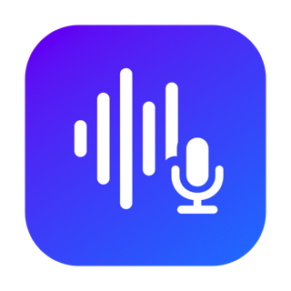

<p align="center">
  
</p>

<h1 align="center">macrec</h1>

<p align="center">
  <b>Always-on macOS meeting recorder.</b><br>
  Mic + system audio, on-device transcription — <code>mac</code> + <code>rec</code>, a sibling of <code>maccal</code> / <code>macmail</code>.
</p>

<p align="center">
  
  
  
  
  
  <a href="https://codecov.io/gh/ikhoon/macrec"></a>
</p>

An always-on macOS **menu-bar app** (with a CLI) that continuously records your **microphone + system audio**, splits the day into **hourly segments**, and **transcribes** the hours that actually contain speech using `whisper.cpp` with **Voice Activity Detection**. Transcripts land as timestamped Markdown in a folder you choose.

Meeting boundaries are intentionally *not* detected — you get clean hourly transcripts and let an LLM segment/curate them later.

### ✨ Highlights

- 🎙️ **Mic + system audio, 24/7** — hourly segments, only speech-containing hours get transcribed
- 🔒 **On-device by default** — audio, transcripts, and the model stay local; the only network use is the one-time model download. The only cloud features are the optional **Deepgram / OpenAI** live-caption engines, off unless you select one *and* add an API key
- 🪶 **Least-privilege capture** — system audio via a Core Audio tap ⇒ *System Audio Recording Only*, **never** Screen Recording (no orange dot)
- 💬 **Live captions** (macOS 26) — a floating overlay transcribes in real time (`Me`/`Them`, speaker-labeled) with **optional live translation** and a **pluggable engine** (Apple on-device / Whisper streaming / Deepgram ☁ / OpenAI ☁), while `whisper.cpp` still writes the authoritative transcript
- 🔇 **Echo cancellation** (opt-in) — a real adaptive AEC (SpeexDSP, statically linked) removes far-end speaker audio from your mic, so the other side isn't transcribed twice when you use speakers
- 🗓️ **Auto-titled** from the overlapping calendar event · monthly folders · self-contained (bundled `whisper-cli` + VAD)

### What it looks like

```text
  ▎ menu bar ▾                         ┌─ macrec live · en-US ───────────┐
  ────────────────────────            │ 10:32:41  Me:   That part next… │
  ⓘ  About macrec                     │ 10:32:45  Them: Yes, review Thu │
  ● Recording · mic + system          │           ↳ レビューは木曜です ▍ │
  🎤 ●●●●○○○○   🔊 ●●●○○○○○           └─────────────────────────────────┘
  ────────────────────────              floating · translucent · draggable
  〰️ Transcribe now                     (Me = blue · Them = green · ↳ = translation)
  ⏸  Pause
  ────────────────────────
  🖐 Grant permissions…
  ⚙️  Settings…      📂 Open transcripts
  ⏻  Quit
```

The overlay's title bar holds the live controls: caption **language**, **engine** (Apple / Whisper / Deepgram ☁ / OpenAI ☁), **source filter** (Both / Me / Them), and an **opacity** slider. The cloud engines need an API key (Settings → Live) and are the only features that send audio off-device — the saved whisper transcript stays local regardless.

## Install

Three paths — pick one.

### Homebrew (recommended)

```bash
brew install --cask ikhoon/tap/macrec
```

Then launch it and grant permissions (see [One-time permissions](#one-time-permissions)):

```bash
open -a macrec        # menu-bar app (the cask installs it to /Applications)
macrec config         # the CLI is on your PATH too
```

Apple Silicon only. The cask installs **macrec.app** to `/Applications` and puts the `macrec` CLI on your `PATH` — one command gives you both. Installing via brew **avoids the Gatekeeper "Open Anyway" step** (the cask strips the download's quarantine flag). `brew upgrade` pulls new releases. First run downloads the model.

### A) Download the app (self-contained, no Homebrew)

Grab **`macrec.zip`**, unzip, drag **`macrec.app`** to `/Applications`, and launch it.

- The app **bundles a self-contained `whisper-cli`** (built static, Metal embedded) and the **silero VAD** model.
- On first run it **downloads the transcription model** (default *Large v3 Turbo*, ~1.6 GB) from **Hugging Face** to `~/Library/Application Support/macrec/models/`; the menu shows `⤓ Downloading model… %`. Change the model in Settings.
- First launch is blocked by Gatekeeper (self-signed): **System Settings → Privacy & Security → "Open Anyway"** once.
- It registers itself as a **Login Item** on first run (24/7 autostart); toggle in Settings.

### B) Build from source (developer machine)

```bash
cd ~/src/macrec
./install.sh
```

`install.sh` will:

1. create a **stable self-signed code-signing certificate** once (`make-signing-cert.sh`),
2. build the app → `macrec.app`,
3. **sign it with that cert** (so TCC permissions survive every rebuild — see below),
4. install a per-user **LaunchAgent** that launches the app at login (with `KeepAlive`).

> On a machine with the dev LaunchAgent, the app leaves autostart to launchd and the "Start at login" toggle shows as managed.

**Formatting:** `brew install swiftformat`, then run `swiftformat .` before committing. The config
(`.swiftformat`) is a hygiene guardrail — whitespace + redundancy only, no restyle — and CI runs
`swiftformat --lint`, failing on drift.

### Building a distributable

```bash
./package.sh        # → dist/macrec.zip
```

`package.sh` builds `whisper.cpp` from source **static** (`BUILD_SHARED_LIBS=OFF`, `GGML_BACKEND_DL=OFF`, Metal embedded) so the bundled `whisper-cli` has **zero `/opt/homebrew` dependencies**, bundles it + the VAD model into a self-signed `macrec.app`, and zips it. Needs Xcode Command Line Tools (`swiftc`/`cmake`); the resulting app needs **neither Homebrew nor a pre-installed model** on the target.

### One-time permissions

On first launch macrec **requests these inline** (normal consent popups — click *Allow*; no Settings trip needed):

- **System Audio Recording Only** → the least-privilege macOS 15+ permission for capturing the system audio mix (records other participants). **Not** Screen Recording.
- **Microphone** → records your voice.
- **Calendar** → titles transcripts from the overlapping meeting event.

They also appear in **System Settings → Privacy & Security** (listed as **macrec**) if you want to toggle them later.

> Why not Screen Recording? System audio is captured with a **Core Audio process tap** (macOS 14.4+), gated by the dedicated **System Audio Recording Only** permission (`kTCCServiceAudioCapture`) — so macrec never requests Screen Recording and no screen content is ever accessed.

The code-signing **designated requirement** references the certificate + bundle id, so **rebuilds keep the grant** (and the Login Item stays registered). Don't delete/regenerate the cert — the key lives only in your login keychain (deliberately no file backup; an on-disk key would let local malware sign itself as macrec and inherit the mic/system-audio grants). If it's ever lost, re-run `make-signing-cert.sh` and re-grant once. If a grant gets into a bad state, reset it once (bundle id `com.ikhoon.macrec`) and relaunch to re-prompt:

```bash
tccutil reset AudioCapture com.ikhoon.macrec
tccutil reset Microphone   com.ikhoon.macrec
launchctl kickstart -k gui/$(id -u)/com.ikhoon.macrec
```

## How it works

```
menu-bar app (login item / launchd) ──► continuous capture
   • system audio : Core Audio process tap (private aggregate device;
                    excludes our own PID + chosen apps, e.g. Spotify)
   • microphone   : a SEPARATE AVCaptureSession
   └─ every hour, on the hour ──► rotate segment
        speech this hour (mic OR system ≥ N s)?
          yes → whisper-cli (VAD + suppress non-speech)
                  → transcripts/YYYY-MM/….md  (+ audio/YYYY-MM/….wav)
          no  → discard
   └─ screen locks / sleeps → suspend capture; wake/unlock → rebuild tap
   └─ daily ──► delete audio/transcripts past their retention window
```

Design notes (each one is a bug we actually hit):

- **System audio uses a Core Audio process tap**, not ScreenCaptureKit — so it needs only the least-privilege *System Audio Recording Only* permission, never Screen Recording, and shows no orange recording dot. The tap sits on a **private aggregate device pinned to the current default output**, so it captures the mix without changing what device you're listening on.
- **The tap excludes our own process** (and any apps you list, e.g. Spotify), so macrec never records itself and excluded apps stay out of the transcript.
- **A tap created before the permission is granted delivers silence.** So the engine starts the tap anyway, then watches for the grant and **rebuilds the tap the moment you click Allow** — capture just begins, no manual restart.
- **Mic is captured via a separate `AVCaptureSession`** on its own path, independent of the system-audio tap.
- **Speaker→mic echo is cancelled with a real AEC** (opt-in *Reduce mic echo on speakers*): when the far end plays through speakers it leaks into the mic and gets transcribed a second time under `Me`. Apple's voice-processing AEC can't help (it only cancels audio the *same* process renders), so macrec feeds the process-tap system audio to a **SpeexDSP** echo canceller as the far-end reference — the echo is subtracted from the mic while your own voice is preserved, even when both sides talk at once. `libspeexdsp` is statically linked, so the app stays self-contained. Set `defaults write com.ikhoon.macrec echoDebug -bool true` to log the canceller's in/out counters for tuning.
- **The app never sets the default output device** — that's left to macOS / tools like SoundSource, so it can't hijack what you're listening to.
- **VAD (silero) + `--suppress-nst`** skip silence/noise, so transcripts don't fill up with whisper's silence hallucinations ("Thank you", subtitle credits, etc.).
- **System audio is the digital mix before your DAC**, so transcription quality is unaffected by analog/output-device noise.
- **Speaker labels**: mic → `Me`, system audio → `Them` (localized to the transcript language), merged by timestamp. Transcripts are auto-titled from the overlapping **calendar** event (prefers ones with a Zoom/Meet/Teams link) — across all calendars, or only the ones you pick in Settings.

## Settings (menu-bar → Settings…)

Stored in `UserDefaults` (suite `com.ikhoon.macrec.prefs`); saving restarts the engine immediately.

| Setting | Default |
| --- | --- |
| Segment length (on the hour) | 1 hour (15 m / 30 m / 1 h / 2 h) |
| Transcription language | Auto-detect |
| **Transcription model** | Large v3 Turbo (turbo-q5_0 / large-v3 / medium / small / base / tiny) |
| …or custom model (URL / path) | empty — overrides the picker (see below) |
| Min. speech to transcribe | 5 s |
| Remove noise/silence (VAD) | on |
| Capture system audio (other participants) | on |
| Reduce mic echo on speakers (SpeexDSP AEC) | off |
| Title transcripts from calendar | on |
| Calendars for titles | all (pick specific ones — empty = all) |
| **Live caption language** (macOS 26) | System |
| **Live translate to** (macOS 26) | Off |
| Timestamps in live captions (macOS 26) | on |
| **Start at login (24/7)** | on (distributed app; managed by LaunchAgent on dev machines) |
| Keep audio (WAV) too | on |
| Keep audio for | 30 days |
| Keep transcripts for | Unlimited |
| Excluded apps | `com.spotify.client` (add more — incl. pick from running apps) |
| Save transcripts to | `~/Documents/macrec/transcripts` |
| Save audio to | `~/Documents/macrec/audio` |

Transcripts are organized into monthly folders (`transcripts/YYYY-MM/`), audio into a separate root (`audio/YYYY-MM/`). Changing the model downloads the new one on demand (models coexist by filename, so switching back never re-downloads). To use a model outside the built-in list, put an `http(s)` URL to a GGML `.bin` (downloaded to App Support) **or** a local file path (used as-is) in **…or custom model** — it overrides the picker. Menu actions: **Transcribe now**, **Pause / Resume**, **Open transcripts folder**, **About macrec** (shows the version), **Quit**.

Power users / headless runs can override any setting via `MR_*` environment variables (e.g. `MR_WHISPER_MODEL`, `MR_MODEL_URL`, `MR_AUDIO_DIR`; precedence: UserDefaults → env → default).

### Live captions & translation (macOS 26)

The menu's **Live captions** toggle opens a floating, always-on-top overlay that transcribes **on-device** (`SpeechAnalyzer`) in real time — each line tinted by speaker (mic = blue, system = green), with an optional timestamp and an **opacity slider** built into the window. Pick the spoken language in **Live caption language** (the title bar shows the active one, e.g. `macrec live · en-US`); set **Live translate to** and each finalized line gets an on-device translation shown beneath it (`↳ …`). It's a live view only — `whisper.cpp` still writes the saved transcript on rotation. macOS 15 and earlier are unaffected (no overlay).

## CLI

The `macrec` command is installed by Homebrew (otherwise the binary lives inside the app at `macrec.app/Contents/MacOS/macrec`):

```bash
macrec help                # usage + all commands (also --help, -h)
macrec version             # print the version (also --version, -v)
macrec mic-status          # 1 if the default input device is in use
macrec perm-status         # 1 if System Audio Recording + Microphone are granted
macrec config              # print resolved settings (model, paths, loginItem status)
macrec request-permission  # trigger/register the TCC prompts
macrec engine              # run the continuous engine headless (no menu bar)
macrec --out out.wav --duration 20 [--exclude-app <bundleid>] [--no-mic]   # one-shot capture
```

## Files

| File | Role |
| --- | --- |
| `macrec.swift` | the whole app: capture engine, model store, transcriber, menu-bar UI, settings, login item, CLI |
| `install.sh` | build + sign + install to `/Applications/macrec.app` + LaunchAgent (dev machine) |
| `package.sh` | build static `whisper-cli` + bundle into a self-contained, self-signed `macrec.app` → `dist/macrec.zip` |
| `speex-bridge.h` | C bridging header exposing the statically linked SpeexDSP echo canceller to Swift |
| `make-signing-cert.sh` | create the stable self-signed signing certificate (once) |
| `config.sh.example` | template for per-machine `config.sh` (paths, model, knobs) — copied on first run |
| `make-icon.swift` | generate the colorful app icon |
| `set-output.swift` | set the default output device by name (audio-routing helper) |
| `live-diagnose.sh` / `verify-capture.sh` | mic/system level checks + capture self-test |

## Privacy

Records your mic **and** other participants' audio. Use only for meetings you're allowed to record (recording a conversation you take part in is legal in both KR and JP). Audio/transcripts and the model all stay **local** — the only network access is the one-time model download from Hugging Face. **Exception:** selecting a **cloud live-caption engine (Deepgram / OpenAI)** streams the live audio to that provider's API while the overlay is open (opt-in: requires choosing the engine *and* entering an API key); the saved transcript still comes from local whisper.

## Requirements

- **End users (download / Homebrew):** macOS 15+ on Apple Silicon. Nothing else — `whisper-cli` and the VAD are bundled; the model downloads on first run.
- **Building from source:** Xcode Command Line Tools (`swiftc`, and `cmake` for `package.sh`) plus `brew install speexdsp` (the echo canceller is statically linked into the binary). `install.sh`'s dev build can also use a Homebrew `whisper-cli` + `~/whisper-models/` if present.
